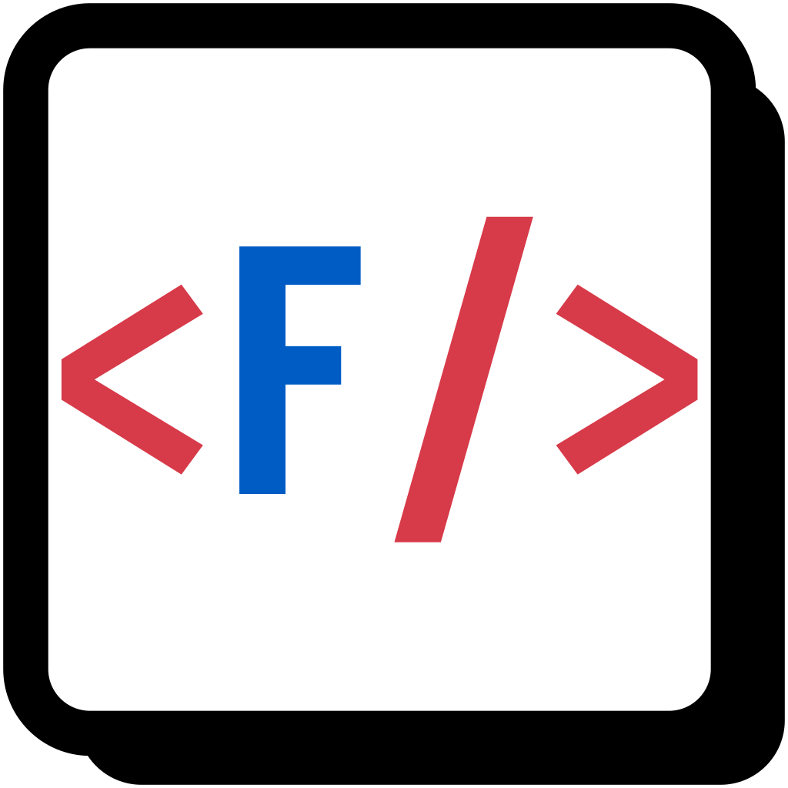

<p align="center">
  <picture>
    <source media="(prefers-color-scheme: dark)" srcset="assets/logo-dark.svg">
    <source media="(prefers-color-scheme: light)" srcset="assets/logo.svg">
    
  </picture>
</p>

# SyntaxFont


Build a font with **built-in syntax highlighting** from any base font — inspired
by [Font with Built-In Syntax Highlighting](https://blog.glyphdrawing.club/font-with-built-in-syntax-highlighting/).

Highlighting lives entirely in OpenType (`COLR`/`CPAL` + `calt`). It works in
`<pre>`, `<code>` and `<textarea>`, and themes switch at runtime from CSS.

Live app: <https://inchei.github.io/SyntaxFont/>

## Quick start

```bash
uv sync
uv run syntaxfont build -f assets/JetBrainsMono-Regular.ttf -l js,css,html -t default -o dist
```

## How it works

- **Generation** — `src/syntaxfont/` duplicates glyphs as empty `.altN` alternates, paints them via `COLR`/`CPAL`, and injects generated `calt` rules with feaLib. The same code runs in the browser inside [Pyodide](https://pyodide.org/) (Web Worker, `web/worker.js`), so nothing is uploaded.
- **Themes** — the first selected theme is baked into `CPAL`; every selected theme is also emitted as CSS `@font-palette-values` for runtime switching.
- **Languages** — `languages/*.yaml` declares keywords, symbols and comment/string regions. Conflicting rules warn in the CLI and web UI; `--isolated-languages` emits one feature per language instead.

## Command line

```bash
uv run syntaxfont build -f base.ttf -l js,python -t night --palettes default -o out
```

| Option               | Meaning                                                                          |
| -------------------- | -------------------------------------------------------------------------------- |
| `-f`                 | base TTF/OTF/TTC/WOFF/WOFF2 font                                                 |
| `--font-number`      | face index for TTC collections (default `0`)                                     |
| `-l`                 | comma-separated language names or YAML paths                                     |
| `-t`                 | theme name or YAML path                                                          |
| `-o`                 | output directory                                                                 |
| `--palettes`         | extra themes emitted as `@font-palette-values`                                   |
| `--name-suffix`      | output filename suffix (default `-highlight`)                                    |
| `--emit-fea`         | also write the generated `features.fea`                                          |
| `--ascii-only`       | only color ASCII inside comments/strings (smaller output)                        |
| `--extra-chars`      | extra characters to color inside comments/strings (e.g. `，。！`)                  |
| `--keep-ligatures`   | keep the base font's ligatures instead of dropping them                          |
| `--isolated-languages` | one OpenType feature per language instead of one combined `calt`               |

## Known limitations

- Matching is literal and bounded: no regular expressions, newlines end every region, long names/interpolations may color partially.
- All enabled languages share one `calt` (conflicts warn; `--isolated-languages` avoids this).
- Ligatures are dropped by default; kept ligatures get a single color and can swallow later triggers (comment/string delimiters still win).
- Without `--keep-ligatures`, `ccmp`/`locl`/`rlig` are dropped, so complex-script shaping will not work.
- Not yet: regex literals, nested block comments, heredocs, multi-line strings, embedded grammars (HTML `<script>`, Markdown fences), semantic type-name coloring.

## Development

```bash
uv run pytest
uv run python scripts/build_web.py      # bundle sources + configs into web/data
uv run python -m http.server -d web 8000  # serve over http, not file://
```

`scripts/make_logo.py` renders the logo; `scripts/shiki_coverage.py` measures highlighting coverage against [Shiki](https://shiki.style) (`--badge` refreshes `assets/shiki-coverage.svg`). CI runs tests and deploys `web/` to GitHub Pages (see `.github/workflows/pages.yml`).

## License

GPL-3.0-or-later — see [LICENSE](LICENSE).
